# Learn2Aid - Empowering Lifesavers

## Introduction

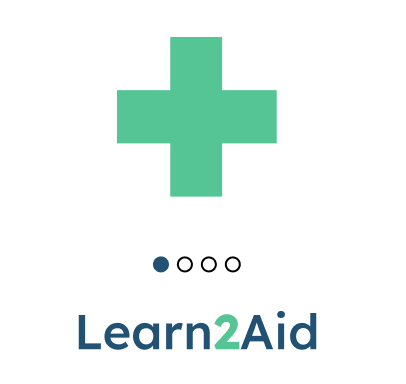

- Learn2Aid is a cutting-edge mobile application developed by the University of Information Technology in Vietnam. In response to the urgent need for first aid knowledge, especially in busy and bustling cities across the APAC region, Learn2Aid aims to bridge the gap between bystanders and trained first responders. Emergencies happen every day, and many people are unprepared to help when it counts the most. Our solution empowers users to act with confidence, turning everyday people into lifesavers.

- Leveraging AI technology, Learn2Aid makes learning first aid easy, interactive, and accessible for everyone. Whether you're at home, at work, or on the go, you can learn life-saving skills at your own pace. From practical video guides to real-time feedback through AI practice, we provide a seamless and engaging experience that helps users develop the skills needed to confidently respond in critical situations.

## Aim

- The primary aim of Learn2Aid is to empower individuals with the confidence and competence to respond effectively in emergency situations. By leveraging AI technology, the app provides a practical and accessible way to learn essential first aid skills. Learn2Aid's goal is not only to teach users how to perform life-saving procedures but also to ensure that these skills are easy to practice, retain, and apply in real-life situations.

- Through interactive quizzes, high-quality video tutorials, and personalized AI feedback, Learn2Aid seeks to create a new generation of well-prepared bystanders who can confidently step in and provide help when needed, ultimately improving health outcomes and saving lives across communities.

## Features

0.  **Interactive Quizzes**: Test your knowledge on first aid procedures with multiple-choice questions and scenarios.

1.  **Step-by-Step Guides**: Detailed instructions for performing first aid in various emergency situations.

2.  **Simulated Training**: Practice techniques through realistic simulations of common first aid scenarios.

3.  **User-Friendly Interface**: An intuitive and accessible design that is easy to navigate for learners of all levels.

4.  **Video learning**: Watch high-quality, expert-verified videos on your phone, breaking down key first aid techniques into easy-to-follow steps.

## Contributing

- We welcome contributions to Learn2Aid. If you'd like to help improve the application, please feel free to fork the repository and submit pull requests. Ensure your contributions are well-documented and tested before submitting.

## Screenshots

### Authentication

  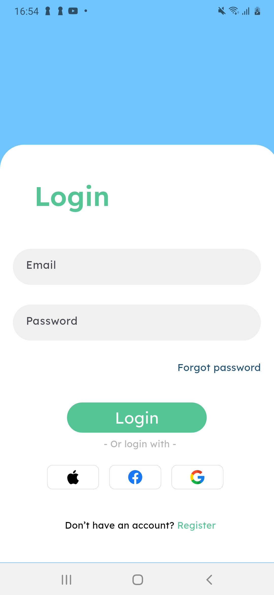
  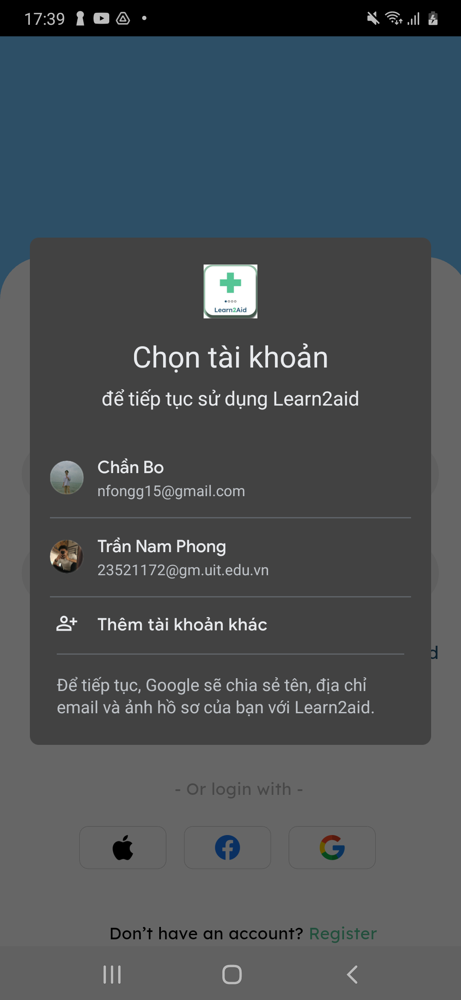

### Dashboard

  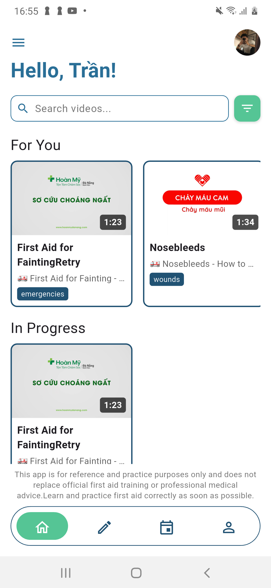
  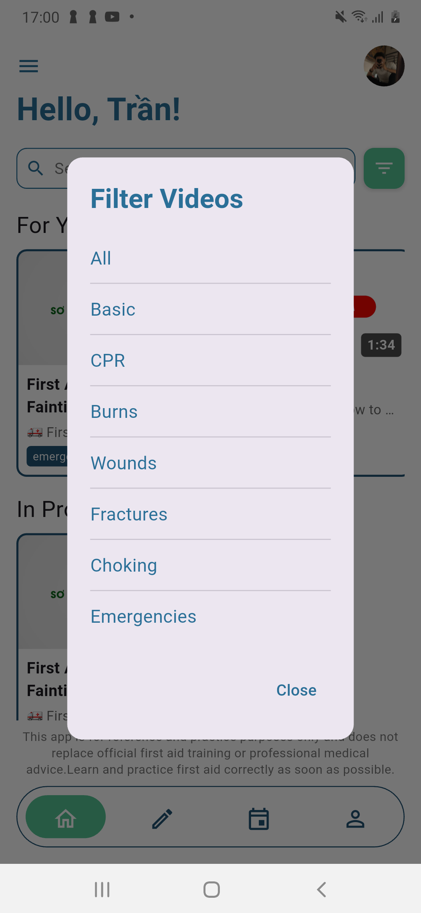
  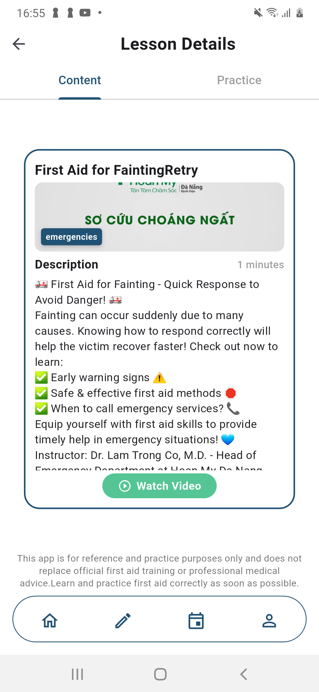
  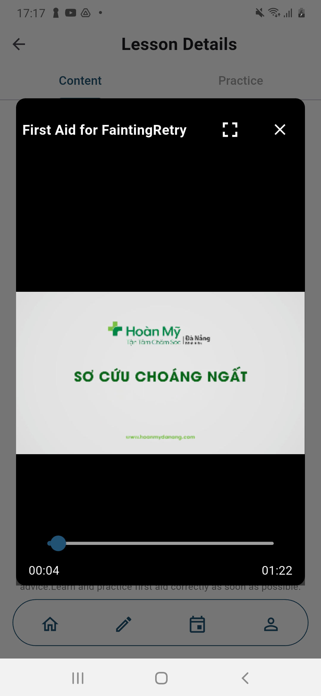
  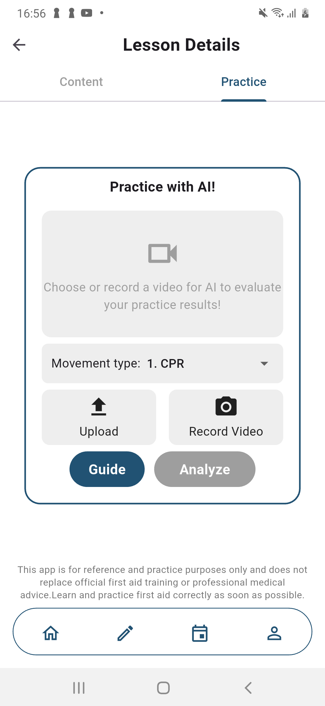
  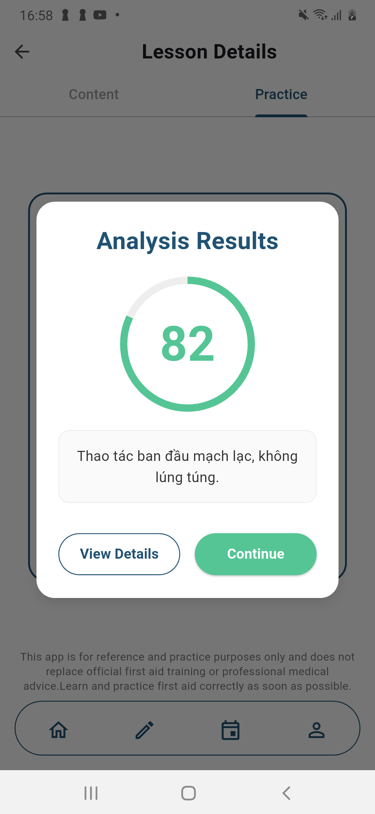
  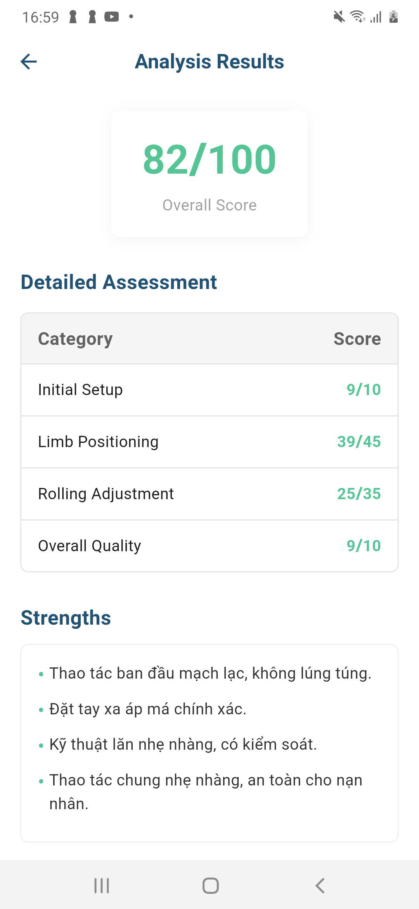
  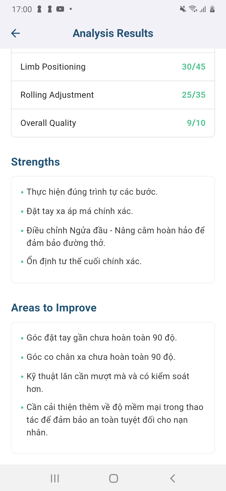

### Quiz

  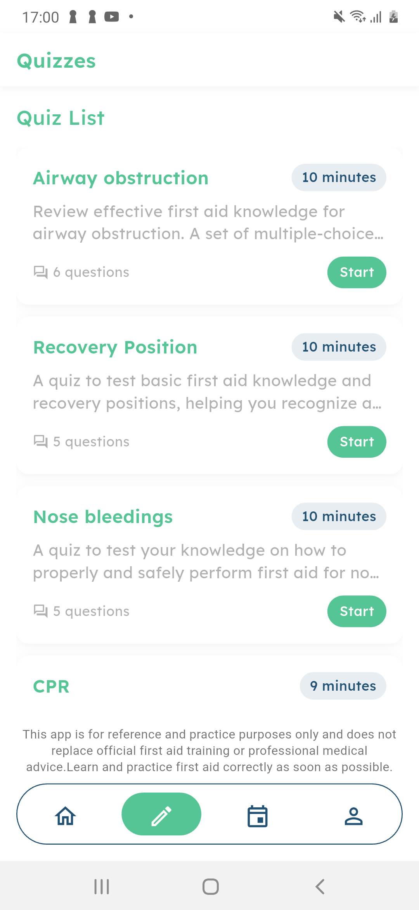
  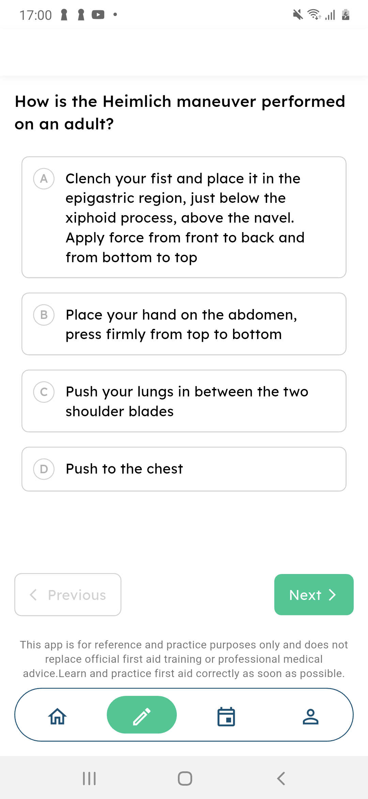
  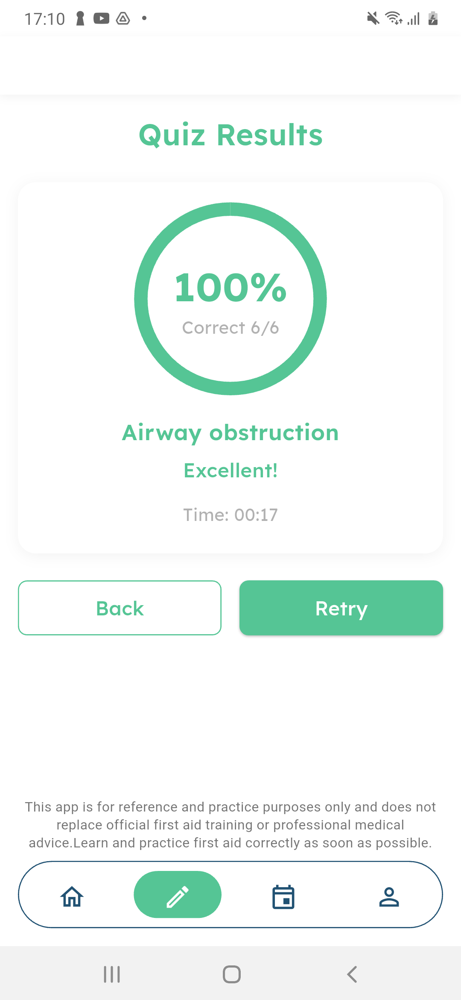
  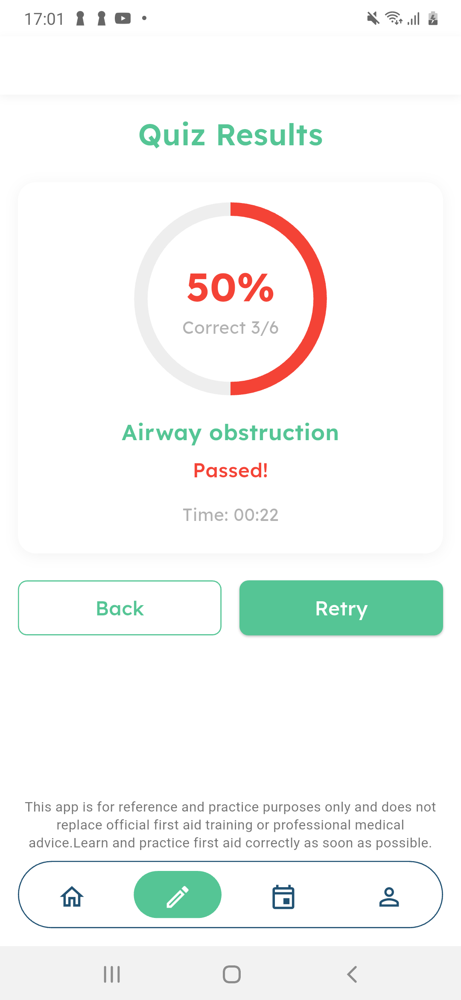

### Events

  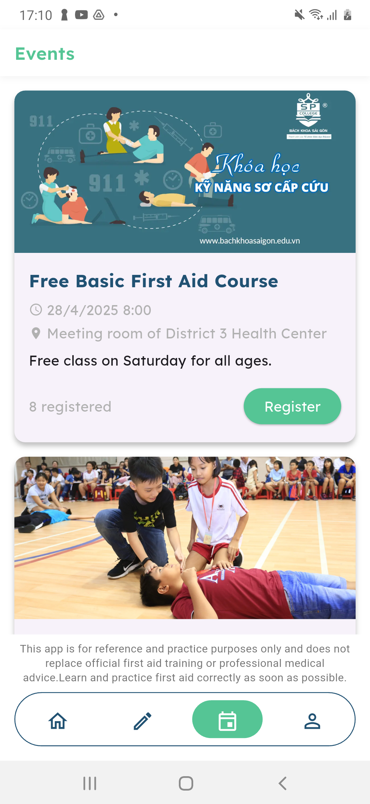
  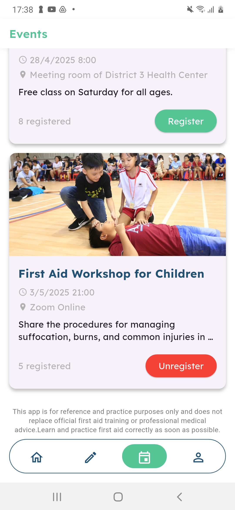

### Profile

  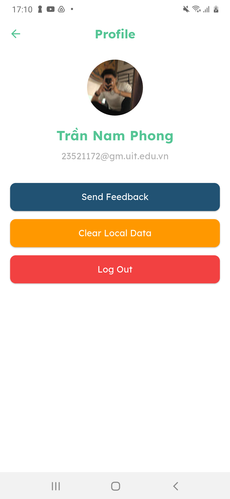
  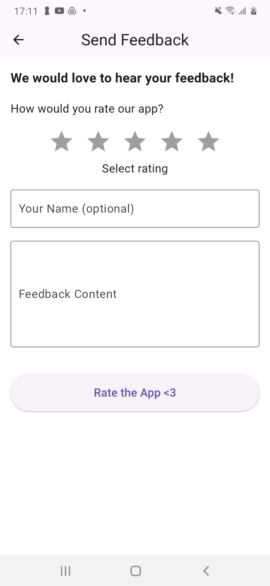

